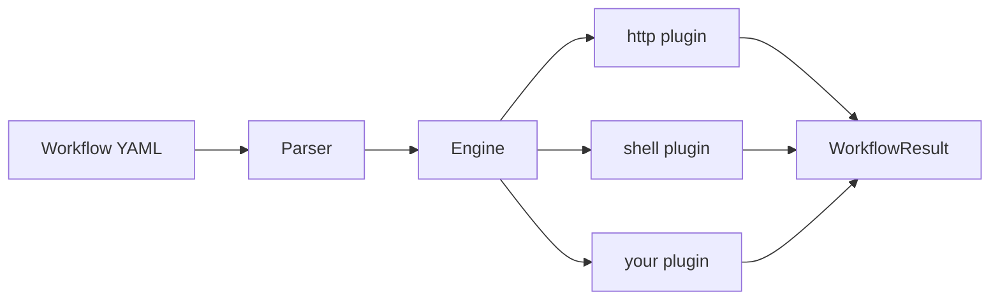

# Orchestrio

[](https://www.python.org/downloads/)

Define workflows in YAML. Execute them via CLI.

The workflow spec is **language-agnostic** — decoupled from the executor so any language can implement it.
The Python executor is the reference implementation.

---

## Getting Started

### Prerequisites

- Python 3.11+
- Git

### Quick start

```bash
git clone https://github.com/hvinn/orchestrio.git
cd orchestrio

python -m venv .venv && source .venv/bin/activate

# Install the Python executor in editable mode
cd executors/python
pip install -e ".[dev]"
cd ../..

# Validate an example workflow
orchestrio validate examples/hello.yaml

# Run it
orchestrio run examples/hello.yaml
```

Add `-v` for debug-level logging:

```bash
orchestrio run examples/hello.yaml -v
```

---

## Architecture

```
orchestrio/
├── workflow-spec/v1/schema.json   # language-agnostic schema
├── examples/                      # sample workflows
├── workflows/                     # real-world workflow samples
└── executors/python/              # Python reference executor
    └── orchestrio/
        ├── cli.py                 # Click CLI entry point
        ├── engine.py              # template resolution + step orchestration
        ├── parser.py              # YAML / JSON loader
        ├── models.py              # Pydantic data models
        ├── utils.py               # shared helpers (path walking, etc.)
        └── plugins/               # step plugins (http, shell, ...)
            ├── base.py            # abstract plugin + registry
            ├── http.py            # HTTP / REST requests
            └── shell.py           # shell command execution
```



### How it works

1. You write a workflow in YAML (or JSON) following the [spec](workflow-spec/v1/schema.json).
2. The executor parses it, resolves templates, and runs each step via plugins (`http`, `shell`, etc.).
3. Steps can reference outputs from earlier steps with `{{ steps.<name>.<path> }}` templates.
4. Failed steps can be retried automatically and the workflow can continue or stop on failure.

---

## Workflow Basics

```yaml
name: hello-world
version: "1"
steps:
  - name: fetch_joke
    type: http
    config:
      method: GET
      url: https://official-joke-api.appspot.com/random_joke
    retry:
      attempts: 2
      delay_seconds: 1

  - name: print_result
    type: shell
    config:
      command: echo "Joke fetched successfully!"
```

### Template syntax

Reference earlier step outputs with `{{ steps.<step_name>.<path> }}`:

| Expression | Resolves to |
|---|---|
| `{{ steps.fetch_joke.body.setup }}` | JSON body field |
| `{{ steps.fetch_joke.status_code }}` | HTTP status code |
| `{{ steps.run_cmd.stdout }}` | Shell stdout |
| `{{ env.MY_VAR }}` | Workflow-level env variable |

### Step features

- **retry** — configure `attempts` and `delay_seconds` for automatic retries
- **on_failure** — `stop` (default) halts the workflow; `continue` proceeds to the next step
- **env** — workflow-level environment variables accessible to all steps

### Examples

| File | What it demonstrates |
|---|---|
| [hello.yaml](examples/hello.yaml) | Minimal workflow — HTTP call + shell echo |
| [chained.yaml](examples/chained.yaml) | Step chaining via template references |
| [cluster_info.yaml](workflows/cluster_info.yaml) | ONTAP cluster info retrieval |
| [cluster_setup_basic.yaml](workflows/cluster_setup_basic.yaml) | Full cluster setup with polling |

### Real-world example — ONTAP cluster info

```yaml
name: cluster_info
version: "1"
description: >-
  Get cluster version and list all nodes with serial numbers.

env:
  ONTAP_HOST: ""       # set via environment or override before running
  ONTAP_USER: "admin"
  ONTAP_PASS: ""       # set via environment or override before running

steps:

  # Step 1 — Get cluster version
  - name: get_cluster
    type: http
    config:
      method: GET
      url: "https://{{ env.ONTAP_HOST }}/api/cluster?fields=version&return_timeout=120"
      headers:
        Accept: "application/hal+json"
        X-Dot-Client-App: "orchestrio"
      username: "{{ env.ONTAP_USER }}"
      password: "{{ env.ONTAP_PASS }}"
      timeout: 30
      verify_ssl: false

  # Print cluster name + version
  - name: print_version
    type: shell
    config:
      command: >-
        echo "Cluster: {{ steps.get_cluster.body.name }} — {{ steps.get_cluster.body.version.full }}"

  # Step 2 — Get all nodes with name and serial number
  - name: get_nodes
    type: http
    config:
      method: GET
      url: "https://{{ env.ONTAP_HOST }}/api/cluster/nodes?fields=name,serial_number&return_timeout=120"
      headers:
        Accept: "application/hal+json"
        X-Dot-Client-App: "orchestrio"
      username: "{{ env.ONTAP_USER }}"
      password: "{{ env.ONTAP_PASS }}"
      timeout: 30
      verify_ssl: false

  # Print node count
  - name: print_nodes
    type: shell
    config:
      command: echo "Nodes in cluster- {{ steps.get_nodes.body.num_records }}"
```

This workflow demonstrates:
- **`env`** block for credentials — keep secrets out of step configs
- **HTTP basic auth** via `username` / `password` fields
- **Template chaining** — `print_version` references `steps.get_cluster.body.*`
- **`verify_ssl: false`** for self-signed certs (common in lab environments)

---

## Custom Plugins

Create a new plugin by subclassing `StepPlugin`:

```python
from orchestrio.plugins.base import StepPlugin
from orchestrio.models import StepDefinition, StepResult, StepStatus

@StepPlugin.register("my_type")
class MyPlugin(StepPlugin):
    async def execute(self, step, context):
        # your logic here
        return StepResult(name=step.name, status=StepStatus.SUCCESS, output={...})
```

Then import it in `orchestrio/plugins/__init__.py` so it auto-registers at startup.

---

## License

MIT
