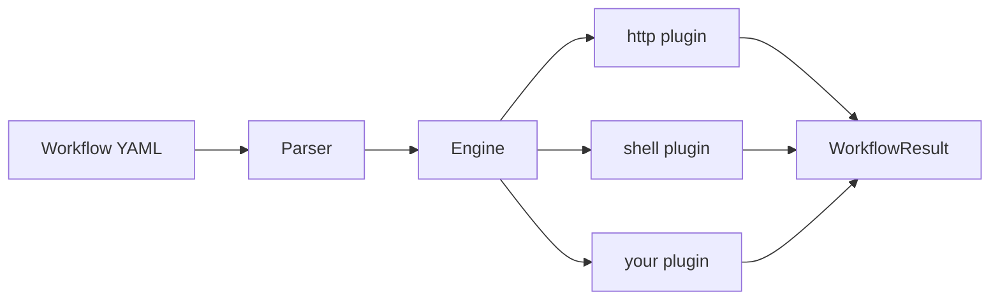

# Orchestrio

[](https://www.python.org/downloads/)
[](LICENSE)

Orchestrio is a no-code/low-code CLI tool for automating NetApp resource workflows using ONTAP REST APIs.

The workflow spec is **language-agnostic** — decoupled from the executor so any language can implement it.
The Python executor is the reference implementation.

---

## Get Started in 2 Minutes

### 1. Install (30 seconds)

```bash
curl -fsSL https://raw.githubusercontent.com/NetApp/orchestrio/main/install.sh | bash
```

That's it. The script detects `pipx` or falls back to `pip`, checks for Python 3.11+, and installs the `orchestrio` command.

<details>
<summary>Manual install (dev mode)</summary>

```bash
git clone https://github.com/NetApp/orchestrio.git
cd yaml-workflows/executor
pip install -e ".[dev]"
```
</details>

### 2. Run Your First Workflow (30 seconds)

```bash
orchestrio run yaml-workflows/examples/hello.yaml
```

This runs a two-step workflow -- fetches a joke from a public API, then echoes a message:

```yaml
# examples/hello.yaml
name: hello-world
version: "1"
steps:
  - name: fetch_joke
    type: http
    config:
      method: GET
      url: https://official-joke-api.appspot.com/random_joke
    retry:
      attempts: 2
      delay_seconds: 1

  - name: print_result
    type: shell
    config:
      command: echo "Joke fetched successfully!"
```

### 3. Chain Steps Together (30 seconds)

Steps can reference output from earlier steps using `{{ steps.<name>.<path> }}`:

```bash
orchestrio run yaml-workflows/examples/chained.yaml
```

```yaml
# examples/chained.yaml (key part)
steps:
  - name: get_user
    type: http
    config:
      method: GET
      url: https://jsonplaceholder.typicode.com/users/1

  - name: get_user_posts
    type: http
    config:
      method: GET
      url: "https://jsonplaceholder.typicode.com/posts?userId={{ steps.get_user.body.id }}"

  - name: summarize
    type: shell
    config:
      command: "echo 'Fetched posts for user: {{ steps.get_user.body.name }}'"
```

The output of `get_user` feeds directly into `get_user_posts` -- no glue code needed.

### 4. Use with ONTAP (30 seconds)

```bash
cp yaml-workflows/workflows/cluster_info.env.example yaml-workflows/workflows/cluster_info.env
# edit cluster_info.env with your ONTAP host, user, password
orchestrio run yaml-workflows/workflows/cluster_info.yaml -E yaml-workflows/workflows/cluster_info.env
```

Credentials stay in the env file, the workflow stays clean:

```yaml
env:
  ONTAP_HOST: ""
  ONTAP_USER: "admin"
  ONTAP_PASS: ""

steps:
  - name: get_cluster
    type: http
    config:
      url: "https://{{ env.ONTAP_HOST }}/api/cluster?fields=version"
      username: "{{ env.ONTAP_USER }}"
      password: "{{ env.ONTAP_PASS }}"
      verify_ssl: false
```

### Next Steps

- Preview without executing: `orchestrio run workflow.yaml --dry-run`
- Step through interactively: `orchestrio run workflow.yaml --interactive`
- Browse more [examples](yaml-workflows/examples/) and [real-world workflows](yaml-workflows/workflows/)
- Create a [custom plugin](#custom-plugins)
- Read the full [CLI Reference](#cli-reference) below

---

## Choose Your Approach

Orchestrio's low-code YAML is the fastest path, but this repo also provides
equivalent examples in Python, Ansible, and Terraform so you can compare and
pick the approach that fits your team.

| | Orchestrio (YAML) | Python Script | Ansible Playbook | Terraform |
|---|---|---|---|---|
| **Lines of code** (cluster info) | 41 | 54 + shared client | 63 | 72 |
| **Install** | `pip install orchestrio` | `pip install requests` | `ansible` + Galaxy collection | `terraform` binary + provider |
| **Learning curve** | YAML only | Python fluency | Ansible + ONTAP modules | HCL + provider knowledge |
| **State management** | Stateless | You manage it | Idempotent modules | Full state tracking |
| **Best for** | Rapid automation, CI/CD | Custom logic, integrations | Fleet ops, config management | Infrastructure lifecycle |

Browse the examples: **[python/](python/)** | **[ansible/](ansible/)** | **[terraform/](terraform/)** |
Read the detailed guide: **[docs/choosing-an-approach.md](docs/choosing-an-approach.md)**

---

## Concepts

| Term | What it is | Where it lives |
|---|---|---|
| **Workflow** | A named, versioned sequence of steps defined in a single YAML file. The top-level unit of execution. | `workflows/` (production) or `examples/` (demos) |
| **Step** | The atomic unit of work. Each step has a `name`, a `type` (`http`, `shell`, or custom), and a `config` dict. | Inline inside a workflow YAML |
| **Step Fragment** | A standalone YAML file containing one reusable step, imported via `include:`. Think of it as a function you call from any workflow. | `steps/` |
| **Plugin** | The executor behind a step type. Built-in: `http` (REST calls), `shell` (subprocess). Extend by subclassing `StepPlugin`. | `yaml-workflows/executor/orchestrio/plugins/` |
| **Template** | A `{{ }}` expression resolved at runtime. Two forms: `{{ steps.<name>.<path> }}` (output of a prior step) and `{{ env.KEY }}` (environment variable). | Inside any string value in `config` |
| **Defaults** | Type-level config merged into every step of that type. Avoids repeating headers, auth, timeouts across steps. | `defaults:` block at workflow root |

### Folder conventions

```
os_orchestrio/
├── python/                 # Python script examples
├── ansible/                # Ansible playbook examples
├── terraform/              # Terraform module examples
├── yaml-workflows/         # Declarative YAML workflow executor (Orchestrio CLI)
│   ├── executor/           #   Python CLI package
│   ├── workflows/          #   Complete, runnable workflow files
│   ├── steps/              #   Reusable step fragments (imported via include:)
│   ├── examples/           #   Tutorial / demo workflows
│   └── workflow-spec/      #   Language-agnostic JSON schema (versioned)
└── docs/                   # Guides and comparison documentation
```

Step names inside YAML follow `snake_case`: `get_cluster`, `poll_job`, `discover_nodes`.
Step fragment files mirror the name: `ontap_get_cluster.yaml`, `ontap_poll_job.yaml`.

---

## Architecture

```
os_orchestrio/
├── yaml-workflows/
│   ├── workflow-spec/v1/schema.json   # language-agnostic schema
│   ├── examples/                      # sample workflows
│   ├── workflows/                     # real-world workflow samples
│   └── executor/                      # Python reference executor
│       └── orchestrio/
        ├── cli.py                 # Click CLI entry point
        ├── engine.py              # template resolution + step orchestration
        ├── parser.py              # YAML / JSON loader
        ├── models.py              # Pydantic data models
        ├── utils.py               # shared helpers (path walking, etc.)
        └── plugins/               # step plugins (http, shell, ...)
            ├── base.py            # abstract plugin + registry
            ├── http.py            # HTTP / REST requests
            └── shell.py           # shell command execution
```



### How it works

1. You write a workflow in YAML (or JSON) following the [spec](yaml-workflows/workflow-spec/v1/schema.json).
2. The executor parses it, resolves templates, and runs each step via plugins (`http`, `shell`, etc.).
3. Steps can reference outputs from earlier steps with `{{ steps.<name>.<path> }}` templates.
4. Failed steps can be retried automatically and the workflow can continue or stop on failure.

---

## CLI Reference

### Commands

| Command | Purpose |
|---|---|
| `orchestrio run <file>` | Execute a workflow |
| `orchestrio run <file> --dry-run` | Resolve all templates and print the execution plan — nothing is executed |
| `orchestrio run <file> --interactive` | Pause after each step; choose to continue, skip, retry, abort, or inspect output |
| `orchestrio validate <file>` | Parse and schema-check a workflow file without running it |

### Global and run flags

| Flag | Short | Description |
|---|---|---|
| `--verbose` | `-v` | DEBUG-level logging (on any command) |
| `--env-file <path>` | `-E` | Load env vars from `.env` / `.yaml` / `.json`. Repeatable; later files win. |
| `--env KEY=VALUE` | `-e` | Set an env var inline. Repeatable; overrides `--env-file` and YAML defaults. |
| `--log-file <path>` | `-L` | Path for the structured JSONL run log. Defaults to `logs/run-<id>.log.jsonl`. |
| `--no-log` | | Disable JSONL log file output entirely. |

### Environment variable precedence

Values are merged in this order (last wins):

```
YAML env: defaults  →  os.environ (scoped)  →  --env-file  →  --env KEY=VALUE
```

### Quick decision table

| I want to … | Command |
|---|---|
| Check my YAML is valid | `orchestrio validate workflow.yaml` |
| See what will run without running it | `orchestrio run workflow.yaml --dry-run` |
| Execute a workflow | `orchestrio run workflow.yaml` |
| Step through interactively | `orchestrio run workflow.yaml --interactive` |
| Debug a failing step | `orchestrio run workflow.yaml -v` |
| Pass credentials from a file | `orchestrio run workflow.yaml -E cluster.env` |
| Override a single variable | `orchestrio run workflow.yaml -e ONTAP_HOST=10.0.0.1` |

---

## Workflow Basics

```yaml
name: hello-world
version: "1"
steps:
  - name: fetch_joke
    type: http
    config:
      method: GET
      url: https://official-joke-api.appspot.com/random_joke
    retry:
      attempts: 2
      delay_seconds: 1

  - name: print_result
    type: shell
    config:
      command: echo "Joke fetched successfully!"
```

### Template syntax

Reference earlier step outputs with `{{ steps.<step_name>.<path> }}`:

| Expression | Resolves to |
|---|---|
| `{{ steps.fetch_joke.body.setup }}` | JSON body field |
| `{{ steps.fetch_joke.status_code }}` | HTTP status code |
| `{{ steps.run_cmd.stdout }}` | Shell stdout |
| `{{ env.MY_VAR }}` | Workflow-level env variable |

### Step features

- **retry** — configure `attempts` and `delay_seconds` for automatic retries
- **on_failure** — `stop` (default) halts the workflow; `continue` proceeds to the next step
- **env** — workflow-level environment variables accessible to all steps

### Examples

| File | What it demonstrates |
|---|---|
| [hello.yaml](yaml-workflows/examples/hello.yaml) | Minimal workflow — HTTP call + shell echo |
| [chained.yaml](yaml-workflows/examples/chained.yaml) | Step chaining via template references |
| [cluster_info.yaml](yaml-workflows/workflows/cluster_info.yaml) | ONTAP cluster info retrieval |
| [cluster_setup_basic.yaml](yaml-workflows/workflows/cluster_setup_basic.yaml) | Full cluster setup with polling |

### Real-world example — ONTAP cluster info

```yaml
name: cluster_info
version: "1"
description: >-
  Get cluster version and list all nodes with serial numbers.

env:
  ONTAP_HOST: ""       # set via environment or override before running
  ONTAP_USER: "admin"
  ONTAP_PASS: ""       # set via environment or override before running

steps:

  # Step 1 — Get cluster version
  - name: get_cluster
    type: http
    config:
      method: GET
      url: "https://{{ env.ONTAP_HOST }}/api/cluster?fields=version&return_timeout=120"
      headers:
        Accept: "application/hal+json"
        X-Dot-Client-App: "orchestrio"
      username: "{{ env.ONTAP_USER }}"
      password: "{{ env.ONTAP_PASS }}"
      timeout: 30
      verify_ssl: false

  # Print cluster name + version
  - name: print_version
    type: shell
    config:
      command: >-
        echo "Cluster: {{ steps.get_cluster.body.name }} — {{ steps.get_cluster.body.version.full }}"

  # Step 2 — Get all nodes with name and serial number
  - name: get_nodes
    type: http
    config:
      method: GET
      url: "https://{{ env.ONTAP_HOST }}/api/cluster/nodes?fields=name,serial_number&return_timeout=120"
      headers:
        Accept: "application/hal+json"
        X-Dot-Client-App: "orchestrio"
      username: "{{ env.ONTAP_USER }}"
      password: "{{ env.ONTAP_PASS }}"
      timeout: 30
      verify_ssl: false

  # Print node count
  - name: print_nodes
    type: shell
    config:
      command: echo "Nodes in cluster- {{ steps.get_nodes.body.num_records }}"
```

This workflow demonstrates:
- **`env`** block for credentials — keep secrets out of step configs
- **HTTP basic auth** via `username` / `password` fields
- **Template chaining** — `print_version` references `steps.get_cluster.body.*`
- **`verify_ssl: false`** for self-signed certs (common in lab environments)

---

## Custom Plugins

Create a new plugin by subclassing `StepPlugin`:

```python
from orchestrio.plugins.base import StepPlugin
from orchestrio.models import StepDefinition, StepResult, StepStatus

@StepPlugin.register("my_type")
class MyPlugin(StepPlugin):
    async def execute(self, step, context):
        # your logic here
        return StepResult(name=step.name, status=StepStatus.SUCCESS, output={...})
```

Then import it in `orchestrio/plugins/__init__.py` so it auto-registers at startup.

---

## How Orchestrio Compares

### Orchestrio vs OnCommand Workflow Automation (WFA)

[OnCommand WFA](https://docs.netapp.com/us-en/workflow-automation/) was a GUI-driven automation server for storage provisioning and orchestration. Orchestrio takes a fundamentally different approach.

| | OnCommand WFA | Orchestrio |
|---|---|---|
| **Interface** | Web-based GUI (Workflow Designer portal) | Headless CLI |
| **Infrastructure** | Dedicated WFA server (Windows/Linux) | No server — runs anywhere Python runs |
| **Workflow definition** | GUI drag-and-drop with commands, templates, finders | Plain YAML files |
| **Version control** | Manual export/import of WFA packs | Git-native — branch, diff, review, merge |
| **CI/CD** | Not designed for pipelines | First-class — single CLI command in any pipeline |
| **Extensibility** | WFA commands (PowerShell/Perl), dictionary entries | Python plugins (subclass + register) |
| **Composability** | Row repetition, approval points | `include:` fragments + `defaults:` deep merge |
| **Data sources** | Built-in caching + CMDB connectors | Environment variables + env files |
| **Spec format** | Proprietary | Open JSON schema (language-agnostic) |
| **Status** | Last documented for ONTAP 9.7 / WFA 5.1 (2022) | Active development |

**In short:** WFA is a portal for storage admins clicking through provisioning tasks. Orchestrio is a CLI for DevOps/SRE teams automating storage workflows as code.

### Workflow Designer vs Orchestrio

These are complementary tools, not competitors:

- **Workflow Designer** = visual GUI for building and exploring workflows (drag-and-drop, visual graph)
- **Orchestrio** = headless CLI for executing workflows (automation, CI/CD, scripting)

They can share the same YAML workflow spec — a workflow designed visually can be exported and run headlessly via Orchestrio, and vice versa.

| Use case | Best tool |
|---|---|
| Explore and prototype a new workflow visually | Workflow Designer |
| Run workflows in CI/CD pipelines | Orchestrio |
| Schedule unattended automation | Orchestrio |
| Onboard non-developers to workflow concepts | Workflow Designer |
| Version-control and code-review workflows | Orchestrio (YAML in Git) |

### Industry landscape

Orchestrio occupies a specific niche: **lightweight, headless, YAML-driven REST API workflow automation** — no server, no cluster, no DSL.

| Tool | Approach | Server required | Workflow format | Sweet spot |
|---|---|---|---|---|
| **Temporal** | Durable execution engine | Yes (Temporal Server) | Code (Go/Java/Python/TS SDKs) | Mission-critical stateful workflows |
| **Prefect** | Python pipeline orchestrator | Yes (Prefect Server/Cloud) | Python decorators | Data pipelines and ETL |
| **Argo Workflows** | Kubernetes-native DAG engine | Yes (K8s cluster) | YAML (K8s CRDs) | Container-based batch jobs |
| **Ansible** | Agentless config management | No (control node only) | YAML playbooks | Host/OS configuration via SSH |
| **Orchestrio** | Headless REST API orchestrator | No | YAML (open spec) | Storage/infra API automation via CLI |

Orchestrio is not trying to replace a full orchestration platform. It targets teams that need to **automate REST API sequences** (especially ONTAP) without deploying infrastructure — just `pip install` and write YAML.

---

## License

Apache-2.0 — see [LICENSE](LICENSE) for details.
