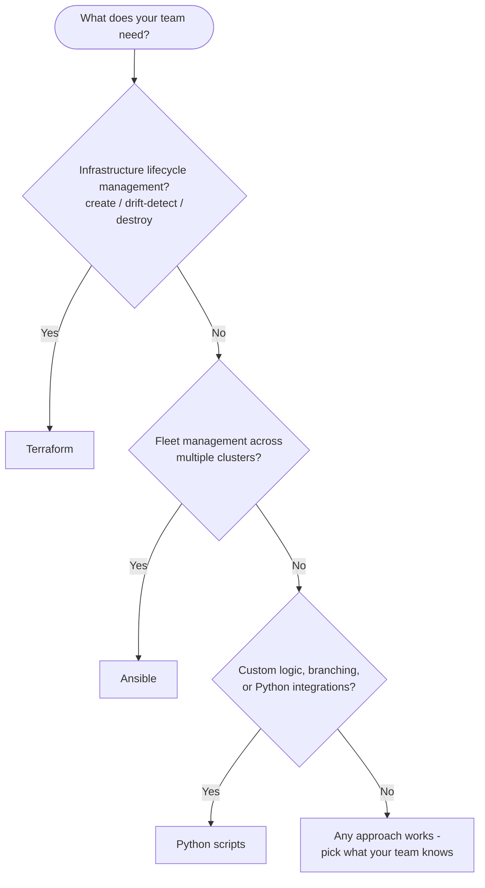

# Choosing an Automation Approach

This guide helps you pick the right tool for automating ONTAP workflows.
All three approaches in this repo do the same things - the difference is
**how much you write**, **what you control**, and **what the tool manages
for you**.

---

## Decision Flowchart



Each tool has clear strengths. There is no single "right" answer - choose based
on your team's existing skills and the operational requirements of your workflow.

---

## Detailed Comparison

### Lines of code (real counts from this repo)

| Use case | Python | Ansible | Terraform |
|---|---|---|---|
| Cluster info | 54 (+188 shared client) | 63 | 72 |
| NFS provision | 145 (+188 shared client) | 96 | 155 |

Notes:
- Python scripts depend on a shared `ontap_client.py` (188 lines). The
  Ansible collection and Terraform provider provide this layer for you.
- Terraform counts include `variables.tf` and `outputs.tf` boilerplate.

### Feature matrix

| Capability | Python | Ansible | Terraform |
|---|---|---|---|
| Idempotency | You build it | Yes (modules) | Yes (plan/apply) |
| State tracking | You build it | No (stateless runs) | Yes (.tfstate) |
| Drift detection | No | No | Yes (plan) |
| Destroy/rollback | You build it | Re-run with `state: absent` | `terraform destroy` |
| Retry on failure | You build it | `retries:` on tasks | Provider-level |
| Dry run / preview | No | `--check` (module-dependent) | `terraform plan` |
| Interactive debug | Debugger (pdb) | `--step` (basic) | No |
| Structured logging | You build it | Callback plugins | JSON plan output |
| Step output chaining | Variables | `register` + Jinja2 | Resource references |
| Parallelism | Threading/asyncio | `serial`, `async` | Dependency graph |
| Fleet / multi-target | Loops (you write) | Inventory groups | `for_each`, modules |
| Secret management | Env vars | Vault, external lookups | `sensitive`, backends |
| Custom logic | Full language | Jinja2, filters | HCL expressions, functions |
| Ecosystem size | All of PyPI | 150+ ONTAP modules | Provider resources |

### Setup effort

| | Python | Ansible | Terraform |
|---|---|---|---|
| **Install** | `pip install requests` | `pip install ansible` + `ansible-galaxy collection install netapp.ontap` | Download binary + `terraform init` |
| **Config files needed** | 1 (script) + env | Inventory + group_vars + playbook | main.tf + variables.tf + tfvars |
| **Time to first run** | ~5 minutes | ~10 minutes | ~10 minutes |

---

## When Each Tool Shines

### Python scripts

- **Custom business logic** - if/else, loops, data transformation
- **Integration with other systems** - combine ONTAP calls with Slack, Jira, databases
- **One-off scripts** for teams that already think in Python
- **Full control** over error handling, retries, and output formatting

### Ansible playbooks

- **Fleet operations** - run the same playbook against 50 clusters via inventory
- **Idempotent provisioning** - `state: present` / `state: absent` does the right thing
- **Teams already using Ansible** for OS/app config management
- **Ansible Tower / AWX** - centralized scheduling, RBAC, audit trail

### Terraform

- **Infrastructure lifecycle** - create, update, destroy with full state tracking
- **Drift detection** - `terraform plan` shows what changed since last apply
- **Multi-provider** - manage ONTAP alongside AWS/Azure/GCP in one plan
- **Compliance / auditability** - state file is the source of truth

---

## Migration Paths

As your automation needs grow, you may migrate between approaches:

```
Python ─────────────┬──→ Ansible     (need inventory-driven fleet ops)
                    └──→ Terraform   (need state tracking and drift detection)
```

The API endpoints, request bodies, and response paths translate directly
across all approaches.

---

## Quick Reference

| I want to... | Use |
|---|---|
| See the exact REST API calls being made | Python |
| Create resources that I can later destroy cleanly | Terraform |
| See what changed on my cluster since last run | Terraform |
| Run the same automation across many clusters | Ansible |
| Ensure repeated runs don't create duplicates | Ansible or Terraform |
| Add custom Python logic to a workflow | Python scripts |
| Integrate ONTAP automation with other tools | Python scripts |
| Combine ONTAP + cloud infra in one config | Terraform |
