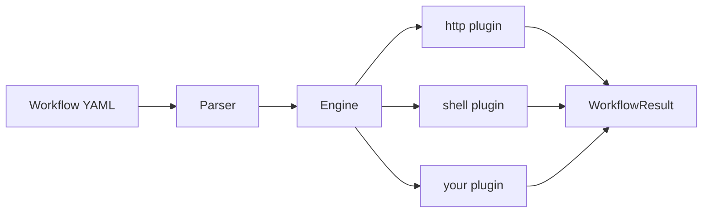

# Orchestrio — YAML Workflow Executor

Orchestrio is a CLI tool for automating ONTAP REST API workflows using declarative YAML.
Write a workflow file, run `orchestrio run`, and get structured output with built-in
retry, dry-run, and interactive step-through.

The full executor source lives in [`yaml-workflows/executor/`](../yaml-workflows/executor/).
Workflow files and reusable step fragments live alongside it in
[`yaml-workflows/workflows/`](../yaml-workflows/workflows/) and
[`yaml-workflows/steps/`](../yaml-workflows/steps/).

---

## Install

Clone the repository and install the executor locally:

```bash
git clone https://github.com/NetApp/orchestrio.git
cd orchestrio/yaml-workflows/executor
pip install -e ".[dev]"
```

This gives you the `orchestrio` CLI command. Run from the repo root so that
workflow paths like `yaml-workflows/workflows/cluster_info.yaml` resolve correctly.

<details>
<summary>One-liner install (requires public repo access)</summary>

```bash
curl -fsSL https://raw.githubusercontent.com/NetApp/orchestrio/main/yaml-workflows/install.sh | bash
```

The script detects `pipx` or falls back to `pip`, checks for Python 3.11+, and
installs the `orchestrio` command directly from the Git repository.
</details>

---

## Quick Start

### Run a workflow

```bash
orchestrio run yaml-workflows/examples/hello.yaml
```

### Chain step outputs

Steps can reference output from earlier steps using `{{ steps.<name>.<path> }}`:

```bash
orchestrio run yaml-workflows/examples/chained.yaml
```

### Use with ONTAP

```bash
cp yaml-workflows/workflows/cluster_info.env.example yaml-workflows/workflows/cluster_info.env
# edit cluster_info.env with your ONTAP host, user, password
orchestrio run yaml-workflows/workflows/cluster_info.yaml -E yaml-workflows/workflows/cluster_info.env
```

---

## Concepts

| Term | What it is | Where it lives |
|---|---|---|
| **Workflow** | A named, versioned sequence of steps defined in a single YAML file. The top-level unit of execution. | `yaml-workflows/workflows/` or `yaml-workflows/examples/` |
| **Step** | The atomic unit of work. Each step has a `name`, a `type` (`http`, `shell`, or custom), and a `config` dict. | Inline inside a workflow YAML |
| **Step Fragment** | A standalone YAML file containing one reusable step, imported via `include:`. Think of it as a function you call from any workflow. | `yaml-workflows/steps/` |
| **Plugin** | The executor behind a step type. Built-in: `http` (REST calls), `shell` (subprocess). Extend by subclassing `StepPlugin`. | `yaml-workflows/executor/orchestrio/plugins/` |
| **Template** | A `{{ }}` expression resolved at runtime. Two forms: `{{ steps.<name>.<path> }}` (output of a prior step) and `{{ env.KEY }}` (environment variable). | Inside any string value in `config` |
| **Defaults** | Type-level config merged into every step of that type. Avoids repeating headers, auth, timeouts across steps. | `defaults:` block at workflow root |

---

## CLI Reference

### Commands

| Command | Purpose |
|---|---|
| `orchestrio run <file>` | Execute a workflow |
| `orchestrio run <file> --dry-run` | Resolve all templates and print the execution plan — nothing is executed |
| `orchestrio run <file> --interactive` | Pause after each step; choose to continue, skip, retry, abort, or inspect output |
| `orchestrio validate <file>` | Parse and schema-check a workflow file without running it |

### Global and run flags

| Flag | Short | Description |
|---|---|---|
| `--verbose` | `-v` | DEBUG-level logging (on any command) |
| `--env-file <path>` | `-E` | Load env vars from `.env` / `.yaml` / `.json`. Repeatable; later files win. |
| `--env KEY=VALUE` | `-e` | Set an env var inline. Repeatable; overrides `--env-file` and YAML defaults. |
| `--log-file <path>` | `-L` | Path for the structured JSONL run log. Defaults to `yaml-workflows/logs/run-<id>.log.jsonl`. |
| `--no-log` | | Disable JSONL log file output entirely. |

### Environment variable precedence

Values are merged in this order (last wins):

```
YAML env: defaults  →  os.environ (scoped)  →  --env-file  →  --env KEY=VALUE
```

### Quick decision table

| I want to ... | Command |
|---|---|
| Check my YAML is valid | `orchestrio validate workflow.yaml` |
| See what will run without running it | `orchestrio run workflow.yaml --dry-run` |
| Execute a workflow | `orchestrio run workflow.yaml` |
| Step through interactively | `orchestrio run workflow.yaml --interactive` |
| Debug a failing step | `orchestrio run workflow.yaml -v` |
| Pass credentials from a file | `orchestrio run workflow.yaml -E cluster.env` |
| Override a single variable | `orchestrio run workflow.yaml -e ONTAP_HOST=10.0.0.1` |

---

## Workflow Basics

```yaml
name: hello-world
version: "1"
steps:
  - name: fetch_joke
    type: http
    config:
      method: GET
      url: https://official-joke-api.appspot.com/random_joke
    retry:
      attempts: 2
      delay_seconds: 1

  - name: print_result
    type: shell
    config:
      command: echo "Joke fetched successfully!"
```

### Template syntax

Reference earlier step outputs with `{{ steps.<step_name>.<path> }}`:

| Expression | Resolves to |
|---|---|
| `{{ steps.fetch_joke.body.setup }}` | JSON body field |
| `{{ steps.fetch_joke.status_code }}` | HTTP status code |
| `{{ steps.run_cmd.stdout }}` | Shell stdout |
| `{{ env.MY_VAR }}` | Workflow-level env variable |

### Step features

- **retry** — configure `attempts` and `delay_seconds` for automatic retries
- **on_failure** — `stop` (default) halts the workflow; `continue` proceeds to the next step
- **env** — workflow-level environment variables accessible to all steps

### Workflow examples

| File | What it demonstrates |
|---|---|
| [hello.yaml](../yaml-workflows/examples/hello.yaml) | Minimal workflow — HTTP call + shell echo |
| [chained.yaml](../yaml-workflows/examples/chained.yaml) | Step chaining via template references |
| [cluster_info.yaml](../yaml-workflows/workflows/cluster_info.yaml) | ONTAP cluster info retrieval |
| [cluster_setup_basic.yaml](../yaml-workflows/workflows/cluster_setup_basic.yaml) | Full cluster setup with polling |

---

## Architecture

```
yaml-workflows/
├── workflow-spec/v1/schema.json   # language-agnostic schema
├── examples/                      # sample workflows
├── workflows/                     # real-world workflow samples
├── steps/                         # reusable step fragments
└── executor/                      # Python reference executor
    └── orchestrio/
        ├── cli.py                 # Click CLI entry point
        ├── engine.py              # template resolution + step orchestration
        ├── parser.py              # YAML / JSON loader
        ├── models.py              # Pydantic data models
        ├── utils.py               # shared helpers
        └── plugins/               # step plugins
            ├── base.py            # abstract plugin + registry
            ├── http.py            # HTTP / REST requests
            └── shell.py           # shell command execution
```



### How it works

1. You write a workflow in YAML (or JSON) following the [spec](../yaml-workflows/workflow-spec/v1/schema.json).
2. The executor parses it, resolves templates, and runs each step via plugins (`http`, `shell`, etc.).
3. Steps can reference outputs from earlier steps with `{{ steps.<name>.<path> }}` templates.
4. Failed steps can be retried automatically and the workflow can continue or stop on failure.

---

## Custom Plugins

Create a new plugin by subclassing `StepPlugin`:

```python
from orchestrio.plugins.base import StepPlugin
from orchestrio.models import StepDefinition, StepResult, StepStatus

@StepPlugin.register("my_type")
class MyPlugin(StepPlugin):
    async def execute(self, step, context):
        # your logic here
        return StepResult(name=step.name, status=StepStatus.SUCCESS, output={...})
```

Then import it in `orchestrio/plugins/__init__.py` so it auto-registers at startup.

---

## How Orchestrio Compares

### Orchestrio vs OnCommand Workflow Automation (WFA)

[OnCommand WFA](https://docs.netapp.com/us-en/workflow-automation/) was a GUI-driven automation server for storage provisioning and orchestration.

| | OnCommand WFA | Orchestrio |
|---|---|---|
| **Interface** | Web-based GUI (Workflow Designer portal) | Headless CLI |
| **Infrastructure** | Dedicated WFA server (Windows/Linux) | No server — runs anywhere Python runs |
| **Workflow definition** | GUI drag-and-drop with commands, templates, finders | Plain YAML files |
| **Version control** | Manual export/import of WFA packs | Git-native — branch, diff, review, merge |
| **CI/CD** | Not designed for pipelines | First-class — single CLI command in any pipeline |
| **Extensibility** | WFA commands (PowerShell/Perl), dictionary entries | Python plugins (subclass + register) |
| **Composability** | Row repetition, approval points | `include:` fragments + `defaults:` deep merge |
| **Spec format** | Proprietary | Open JSON schema (language-agnostic) |

### Workflow Designer vs Orchestrio

These are complementary tools:

- **Workflow Designer** = visual GUI for building and exploring workflows
- **Orchestrio** = headless CLI for executing workflows (automation, CI/CD, scripting)

They can share the same YAML workflow spec — a workflow designed visually can be exported and run headlessly via Orchestrio, and vice versa.

### Industry landscape

| Tool | Approach | Server required | Workflow format | Sweet spot |
|---|---|---|---|---|
| **Temporal** | Durable execution engine | Yes (Temporal Server) | Code (Go/Java/Python/TS SDKs) | Mission-critical stateful workflows |
| **Prefect** | Python pipeline orchestrator | Yes (Prefect Server/Cloud) | Python decorators | Data pipelines and ETL |
| **Argo Workflows** | Kubernetes-native DAG engine | Yes (K8s cluster) | YAML (K8s CRDs) | Container-based batch jobs |
| **Ansible** | Agentless config management | No (control node only) | YAML playbooks | Host/OS configuration via SSH |
| **Orchestrio** | Headless REST API orchestrator | No | YAML (open spec) | Storage/infra API automation via CLI |
